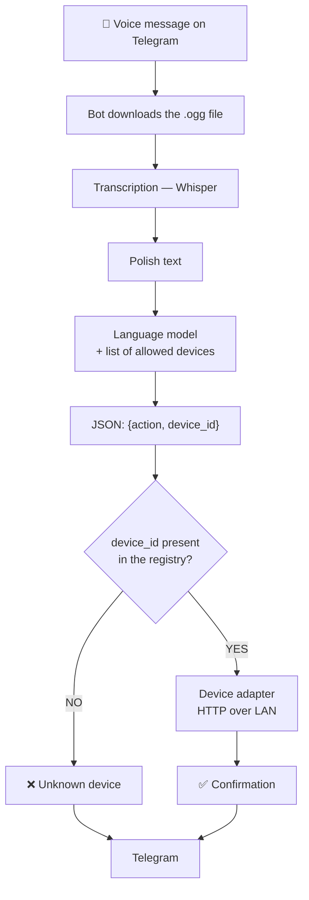

# Jarvis

**Voice-controlled smart home over Telegram — in Polish or English, using your own names for devices.**

Record a voice message on Telegram. Jarvis transcribes it, a language model works out what you
meant, and the right device switches on or off. If the device doesn't exist, it says so plainly
instead of guessing.

```
"włącz pączka"              →  ✅ Pączek — włączone
"turn on the donut"         →  ✅ Pączek — włączone
"włącz plejstejszyn"        →  ✅ PlayStation — włączone
"a co tam u pączka?"        →  ℹ️ Pączek — włączone, pobór 8.4 W
"włącz lampę w garażu"      →  ❌ Nie znam takiego urządzenia
"jaka jutro pogoda?"        →  ❓ Nie zrozumiałem polecenia
```

*Pączek* ("doughnut") is the actual name of a lamp in the author's flat. That's the whole point:
**you talk to your home the way you normally talk** — your own names, any grammatical case,
sloppy phrasing included. You don't learn commands; the system learns you.

Commands work in Polish and English. Speech language is auto-detected; the device names stay
whatever you called them.

---

## Contents

- [Features](#features)
- [How it works](#how-it-works)
- [Tech stack](#tech-stack)
- [Setup](#setup)
  - [1. Create the Telegram bot](#1-create-the-telegram-bot)
  - [2. Get a Groq API key](#2-get-a-groq-api-key)
  - [3. Set up a Shelly plug](#3-set-up-a-shelly-plug)
  - [4. Set up a PlayStation 5](#4-set-up-a-playstation-5)
  - [5. Install and run](#5-install-and-run)
- [Adding devices](#adding-devices)
- [Supporting other hardware](#supporting-other-hardware)
- [Why it doesn't hallucinate](#why-it-doesnt-hallucinate)
- [Architecture](#architecture)
- [Deployment](#deployment)
- [Design decisions](#design-decisions)
  - [PS5 library workarounds](#working-around-an-unmaintained-ps5-library)

---

## Features

- 🎤 **Voice messages** — you speak, you don't type
- 🌍 **Polish and English** — same command set, language auto-detected
- 🏷️ **Your own device names** — "Pączek", "the one behind the TV", plus grammatical inflection
- 🔀 **Understands intent, not keywords** — "it got dark, turn something on" works
- 🔌 **On / off / toggle / status** — including live power draw in watts
- 🎮 **PlayStation 5** — wake from rest mode, put to rest, read what's running
- 🛑 **Never invents devices** — two independent barriers, see [below](#why-it-doesnt-hallucinate)
- 🔒 **User allowlist** — fail-closed, strangers can't touch your lights
- ⚡ **~1.5 s** from end of recording to the relay clicking
- 🏠 **Local control** — devices are reached over your LAN, bypassing the vendor cloud

## How it works



## Tech stack

| Layer | Technology | Why |
|---|---|---|
| Language | **Python 3.12** | async end to end |
| Input | **python-telegram-bot** | voice messages, allowlist |
| Transcription | **Groq — `whisper-large-v3-turbo`** | strong Polish, ~1 s |
| Understanding | **Groq — `openai/gpt-oss-120b`** | speech → JSON via structured outputs |
| API client | **openai SDK** | one interface for Groq, OpenAI and Ollama |
| Devices | **httpx** + Shelly Gen3 RPC | local HTTP, no cloud |
| Console | **pyremoteplay** + raw DDP sockets | PS5 wake / rest / status |
| Registry | **PyYAML** | all devices in one file |
| Deployment | **Docker Compose** | single container, restart policy |

Hardware requirements are negligible — the heavy lifting happens in the APIs, so the app is a
thin coordinator. Tens of MB of RAM, near-zero CPU. It runs happily on decade-old hardware or
a Raspberry Pi.

**Supported hardware:** Shelly Gen3 (Plug S and relatives) and PlayStation 5. Adding another
vendor is one new file — see [Supporting other hardware](#supporting-other-hardware).

---

## Setup

### 1. Create the Telegram bot

1. Open [@BotFather](https://t.me/BotFather) in Telegram and send `/newbot`
2. Pick a **display name** (anything, e.g. `Jarvis`)
3. Pick a **username** — it must be unique and end in `bot`, e.g. `my_home_jarvis_bot`
4. BotFather replies with a token like `1234567890:AAE...`. Put it in `.env` as
   `TELEGRAM_BOT_TOKEN`

Optional polish, all via BotFather:

| Command | Effect |
|---|---|
| `/setdescription` | text shown on the empty chat screen |
| `/setabouttext` | short bio on the bot's profile |
| `/setuserpic` | profile picture |
| `/setcommands` | command hints; paste `devices - list known devices` |

**Then lock it down.** A Telegram bot is public — anyone who guesses the username can message
it. Jarvis therefore only answers user IDs listed in `TELEGRAM_ALLOWED_USER_IDS`, and an empty
list rejects *everyone*. To find your ID, send any message to your bot and run:

```bash
python3 scripts/whoami.py
```

It prints your numeric ID and the exact line to paste into `.env`.

> **If your token ever leaks** — pasted into a chat, committed, shared in a screenshot — send
> `/revoke` to BotFather and pick your bot. You get a fresh token and the old one dies instantly.

### 2. Get a Groq API key

1. Go to [console.groq.com/keys](https://console.groq.com/keys) and sign in with Google or GitHub
2. Click **Create API Key**, copy it (starts with `gsk_`)
3. Put it in `.env` as `GROQ_API_KEY`

One key covers both transcription and understanding. At roughly 30 commands a day this stays
comfortably inside the free tier.

> Groq rotates its model line-up — `llama-3.3-70b-versatile` disappeared during this project.
> If you get a `model_not_found` error, list what's currently available:
> ```python
> OpenAI(api_key=..., base_url="https://api.groq.com/openai/v1").models.list()
> ```

### 3. Set up a Shelly plug

A factory-fresh Shelly does **not** join your Wi-Fi on its own — it broadcasts its own network
and waits to be configured.

1. **Plug it in.** It starts an open Wi-Fi network named `ShellyPlugSG3-XXXXXXXXXXXX`
2. **Connect** your phone or laptop to that network
3. **Open `http://192.168.33.1`** in a browser — this is the plug's built-in config page
4. Go to **Settings → Wi-Fi**, select your home network and enter the password
   - ⚠️ **2.4 GHz only.** Shelly cannot see 5 GHz networks. If your router advertises separate
     names per band, pick the 2.4 GHz one
5. The plug reboots and joins your LAN
6. **Find its IP address** — check your router's client list, or scan the subnet:
   ```bash
   for i in $(seq 1 254); do (nc -z -G 1 192.168.1.$i 80 2>/dev/null && echo "192.168.1.$i") & done; wait
   ```
7. **Confirm it really is a Shelly:**
   ```bash
   curl http://192.168.1.87/rpc/Shelly.GetDeviceInfo
   ```
   You should get back JSON with `"gen": 3` and a model like `S3PL-00112EU`
8. **Reserve the IP via DHCP** in your router, tied to the plug's MAC address

> **Step 8 is not optional.** The registry points at a fixed IP. If your router hands out a
> different address later, the device silently disappears and you get a confusing "not
> responding" error weeks after everything worked.

Useful endpoints for testing by hand:

| Action | Request |
|---|---|
| Identify | `GET http://<ip>/rpc/Shelly.GetDeviceInfo` |
| Status + power | `GET http://<ip>/rpc/Switch.GetStatus?id=0` |
| On | `GET http://<ip>/rpc/Switch.Set?id=0&on=true` |
| Off | `GET http://<ip>/rpc/Switch.Set?id=0&on=false` |
| Toggle | `GET http://<ip>/rpc/Switch.Toggle?id=0` |

> **Note on Shelly authentication.** The adapter currently talks to unauthenticated devices.
> If you enable a password in the plug's settings, `devices/shelly.py` needs to send digest
> auth. On a trusted home LAN, leaving auth off is the normal setup.

### 4. Set up a PlayStation 5

The PS5 can be woken and put to rest over the LAN, and it reports its own status. Sony has no
public API for this — Jarvis speaks the Remote Play discovery protocol, which needs a one-time
pairing with your PSN account.

**On the console** — `Settings → System → Power Saving → Features Available in Rest Mode`:

- ✅ **Stay Connected to the Internet**
- ✅ **Enable Turning on PS5 from Network**

Then `Settings → System → Remote Play` → **Enable Remote Play**.

Optionally `Settings → System → HDMI` → **Enable HDMI Device Link**. With HDMI-CEC the console
turns your TV on and switches its input when it wakes — handy if the TV itself has no network.

**Reserve the console's IP** in your router, exactly as for the Shelly.

**Pair with your account.** The console must be **switched on** during pairing:

```bash
pip install pyremoteplay "pyee<12" async_timeout
pyremoteplay -r 192.168.1.36
```

The wizard walks you through three steps:

1. It prints a PSN login URL — open it in a browser and sign in
2. You land on a page that looks blank or broken; that is expected. Copy the whole address bar
   (`https://remoteplay.dl.playstation.net/remoteplay/redirect?code=...`) back into the terminal
3. On the console, `Settings → System → Remote Play → Link Device` shows an **8-digit PIN**.
   Type it in

> That redirect URL contains an authorisation code for your PSN account. Paste it into your own
> terminal only — never into a chat, an issue, or a commit.

Pairing writes `~/.pyremoteplay/.profile.json`. Copy it next to your config and point the
registry at it:

```bash
cp ~/.pyremoteplay/.profile.json config/.ps5-profile.json
chmod 600 config/.ps5-profile.json
```

Then add the console to `config/devices.yaml`, using `options.host_id` to pick the right entry
from the profile (it is the `host-id` the console reports, also the key in the profile file):

```yaml
  - id: ps5
    name: "PlayStation"
    type: ps5
    host: 192.168.1.36
    options:
      host_id: 68286C32BF27
    aliases:
      - playstation
      - plejstejszyn      # how a Pole says it out loud
      - ps5
      - konsola
```

Check it by hand at any time — this needs no credentials:

```bash
printf 'SRCH * HTTP/1.1\ndevice-discovery-protocol-version:00030010\n' \
  | nc -u -w2 192.168.1.36 9302
```

`HTTP/1.1 200 Ok` means on, `620 Server Standby` means resting.

> **"Turn on" means "wake from rest mode".** A console shut down completely cannot be woken by
> anything on the network. Use *Enter Rest Mode*, not *Turn Off PS5*.

### 5. Install and run

```bash
git clone https://github.com/mandacode/llm-home-automation.git
cd llm-home-automation

python3 -m venv .venv && .venv/bin/pip install -e .

cp .env.example .env                                  # tokens go here
cp config/devices.example.yaml config/devices.yaml    # device IPs go here

.venv/bin/python -m jarvis.main
```

Test the understanding layer without Telegram or hardware:

```bash
python3 scripts/try_intent.py "włącz pączka"
```

---

## Adding devices

Your whole home lives in **`config/devices.yaml`**. Adding a device means adding an entry and
restarting — **no code changes**.

```yaml
devices:
  - id: paczek              # technical id: no spaces, ASCII only
    name: "Pączek"          # the name the bot says back to you
    type: shelly_plug       # hardware type = which adapter handles it
    host: 192.168.1.87      # IP address on your LAN
    room: salon             # optional, helps disambiguate similar names
    aliases:                # how you actually refer to it out loud, in any language you use
      - pączek
      - pączka
      - pączku
      - pączkiem
      - donut
      - light
    misheard:               # what speech-to-text produces when it gets it wrong
      - ponczek
      - bądźka
      - wątponczka
```

**Aliases are the most important field.** The model has no way to know your device names —
"Pączek" appears nowhere in its training data. Listing them turns guesswork into fact.

For inflected languages, list the **grammatical cases** you'd actually say ("włącz pączk**a**",
"zgaś pącz**ek**", "co z pączk**iem**"). The model handles inflection on its own, but an
explicit list is more reliable and costs nothing.

Aliases **do not widen** the set of controllable devices — they improve recognition accuracy,
they don't loosen the safety guarantees.

Adapters that need extra settings read them from an optional `options` mapping, kept out of
the shared schema so one vendor's quirks never leak into another's:

```yaml
    options:
      host_id: 68286C32BF27    # PS5: which entry in the pairing profile to use
```

### The `misheard` field

Unusual proper nouns are the weak point of speech-to-text, not of the language model. Real
transcripts of someone saying *"włącz pączka"* came back as:

```
"Wątponczka."        "Włącz, bądźka."        "Ponczek."
```

The model then correctly reported an unknown device — the text genuinely contained nothing
resembling one. Two independent fixes address this:

1. **A vocabulary hint for Whisper.** The registry's device names and aliases are passed as the
   transcription `prompt`, biasing recognition towards your actual vocabulary.
2. **The `misheard` list.** Whatever mangled forms you observe in practice go here, and the
   language model learns to map them back to the device.

**These two lists must stay separate, and that separation is the whole point.** `aliases` feed
the Whisper hint; `misheard` never does. Telling Whisper that "bądźka" is valid vocabulary would
teach it the very error you're trying to correct. `misheard` is therefore consumed only by the
language model, downstream of transcription.

Adding fuzzy variants doesn't weaken the safety guarantees — *"zjadłbym pączka z lukrem"*
("I could go for a doughnut with icing") still returns "not a command", because matching happens
on intent, not on substrings.

After editing, restart the app (`docker compose restart`, or rerun the process).
`devices.yaml` is mounted read-only into the container, so **the image never needs rebuilding**.

## Supporting other hardware

Want Tuya, Home Assistant, or anything else? Write a class satisfying the `DeviceAdapter`
protocol in [`devices/base.py`](src/jarvis/devices/base.py):

```python
class MyAdapter:
    device_type = "my_device"          # matches the `type` field in devices.yaml

    async def turn_on(self, device: Device) -> str: ...
    async def turn_off(self, device: Device) -> str: ...
    async def toggle(self, device: Device) -> str: ...
    async def status(self, device: Device) -> str: ...
```

Register it in the `adapters` dict in [`main.py`](src/jarvis/main.py) and use the new `type` in
`devices.yaml`. Everything else — understanding, validation, the bot — stays untouched, because
it only ever knows the protocol, never a specific vendor.

## Why it doesn't hallucinate

Most tutorials put "do not invent devices" in the prompt and call it done. **That's a request,
not a guarantee.** Jarvis enforces a hard rule instead:

> The language model never decides which devices exist. `devices.yaml` is the single source of
> truth. The model may only **point at** its entries.

Two independent barriers implement it:

**1. Schema-level constraint.** `device_id` is not free text — it's an enum generated from the
registry on every request:

```python
"device_id": {"enum": ["paczek", "bedroom-socket", None]}
```

With structured outputs the decoder has every token outside that set blocked. The model
**cannot** emit a device that isn't in the registry — not because it chooses not to, but
because that path doesn't exist during decoding.

**2. Code-level validation.** Independently of the above, membership is checked before any
action runs:

```python
device = registry.resolve(intent.device_id)
if device is None:
    return "Nie znam takiego urządzenia."
```

This barrier holds even if you swap in a provider without structured outputs, if the model
returns garbage, or if someone edits the prompt. **Safety does not depend on model behaviour.**

The model also gets an explicit, legitimate way to say "I don't understand". Without one you
force it to guess — and forced guessing is precisely the mechanism that produces
hallucinations.

## Architecture

Every layer has one protocol and a swappable implementation.

| Layer | Protocol | Implementation | Alternatives |
|---|---|---|---|
| Input | — | Telegram | — |
| Transcription | `Transcriber` | Groq Whisper | OpenAI, local faster-whisper |
| Understanding | `IntentParser` | Groq `gpt-oss-120b` | Ollama, OpenAI, Gemini |
| Registry | — | YAML | import from Home Assistant |
| Execution | `DeviceAdapter` | Shelly Gen3 RPC | Tuya, Home Assistant |

```
src/jarvis/
├── main.py                 dependency wiring — the only place aware of concrete providers
├── config.py               configuration from environment variables
├── core/
│   ├── models.py           Action, Device, Intent, ActionResult
│   └── pipeline.py         orchestration + device validation
├── bot/telegram.py         voice handler, allowlist
├── stt/
│   ├── base.py             Transcriber protocol
│   └── whisper_api.py      Groq / OpenAI
├── llm/
│   ├── base.py             IntentParser protocol
│   ├── schema.py           builds the JSON Schema from the registry
│   ├── prompt.py           system prompt
│   └── openai_compat.py    Groq / OpenAI / Ollama
└── devices/
    ├── base.py             DeviceAdapter protocol
    ├── registry.py         registry + validation
    └── shelly.py           Shelly Gen3 RPC
```

`core/` imports no concrete implementation — only protocols. That makes the whole pipeline
testable without network access or API keys.

## Deployment

```bash
git clone https://github.com/mandacode/llm-home-automation.git
cd llm-home-automation

cp .env.example .env                                  # tokens
cp config/devices.example.yaml config/devices.yaml    # device IPs

docker compose up -d --build
docker compose logs -f
```

Updating later:

```bash
git pull && docker compose up -d --build
```

`.env` and `config/devices.yaml` are deliberately kept out of the repository — they hold secrets
and the layout of your home.

**The host must share a LAN with your devices** — control goes straight to their IP addresses.

**One instance per token.** Telegram refuses to let two processes poll the same bot
(`getUpdates` returns a 409 conflict). To run a local instance alongside a server one, create a
second bot in BotFather and use a separate token.

## Design decisions

### Working around an unmaintained PS5 library

`pyremoteplay` is the only practical way to wake and rest a PS5 from Python, and it is barely
maintained. Three defects were found and worked around; all three are worth knowing before
touching `devices/ps5.py`.

**1. It doesn't install on current versions.** It calls `pyee.ExecutorEventEmitter`, removed in
pyee 12, and pulls a transitive dependency it never declares. Hence the pins:

```
pyremoteplay>=0.7.6
pyee<12
async_timeout>=4.0
```

It also compiles `netifaces` from source, so the Docker build needs a compiler. That's why the
image is built in two stages — `gcc` lives in the builder and never reaches the runtime image.

**2. `wakeup(user=...)` silently does nothing.** A console in rest mode omits `host-id` from its
discovery response, so the library can't match it to a stored profile, logs `Profile not found`
and returns without sending a packet. The fix is to pass the registration key instead, which
takes precedence over the profile lookup:

```python
rp.wakeup(key=regist_key)   # works; wakeup(user=...) does not
```

**3. `standby()` reports failure when it succeeds.** The session handshake fails against current
console firmware (`Version not accepted`) and the call returns `False` — but the command reaches
the console and it does go to sleep. **Never trust the return value.** The adapter polls the
discovery protocol until the console actually reports `620 Server Standby`.

The lesson generalises: when a library and the hardware disagree, believe the hardware. Status is
therefore read over a raw UDP socket with no library involved at all — which is also why
`status` keeps working even if `pyremoteplay` breaks again.

### Why hosted APIs instead of a local model

A local Ollama running `qwen2.5:1.5b` was seriously considered. The deciding argument:
**"local means independent and private" doesn't hold here.** Telegram needs the internet, and
so does transcription. A local model therefore buys exactly zero offline capability, while
costing:

| | Local (decade-old CPU, no AVX2) | Groq |
|---|---|---|
| Response | ~15–20 s | ~0.4 s |
| Polish quality | weak (Polish is a sliver of a 1.5B model's training) | strong |
| Cost / month at 30 commands a day | free | ~€0.05 (in practice: free tier) |

**When this flips:** the day the input stops being Telegram and becomes a microphone in the room
with a wake word. Offline stops being an illusion then. The switch is already wired — Ollama
exposes an OpenAI-compatible endpoint, so `LLM_PROVIDER=ollama` is enough. No code changes.

Note that older Ollama builds don't support `json_schema`, which disables barrier 1.
`Config.uses_structured_output` detects this and stops enforcing the schema — **barrier 2 keeps
working**, because it doesn't depend on the provider. That's exactly the scenario the two
independent barriers exist for.

### Why `openai/gpt-oss-120b`

Chosen by measurement, not assumption. Every candidate scored perfectly on a set of Polish
commands, so latency decided it:

| Model | Accuracy | Latency |
|---|---|---|
| **`openai/gpt-oss-120b`** | 9/9 | **0.78 s** |
| `openai/gpt-oss-20b` | 9/9 | 1.59 s |
| `qwen/qwen3.6-27b` | 9/9 | 4.21 s |

The 120B model turned out **twice as fast as the smaller 20B** — on Groq, size doesn't map
directly onto response time. Which is exactly why this gets measured rather than assumed.

### Why `LLM_MAX_TOKENS` is 1024, not ~50

The answer itself is ~25 tokens of JSON, so a tight cap looks obvious. **It's a trap.**

`gpt-oss` is a **reasoning model** — it generates an internal chain of thought before emitting
the answer, and that counts against the limit too. At `max_tokens=100` every request fails,
**despite a perfectly valid schema**:

```
json_validate_failed: max completion tokens reached before generating a valid document
```

The message points at the schema or the prompt and sends you down the wrong path — the only
culprit is the token budget. `LLM_REASONING_EFFORT=low` cuts reasoning from 113 to 46 tokens
with no loss of accuracy. **Don't lower `LLM_MAX_TOKENS` as an optimisation** — the saving is
imaginary and the failure is total.

### Why the system prompt is in Polish

The codebase is English; the prompt is not. That's deliberate and measured. Both variants were
benchmarked on 17 Polish commands:

| Variant | Accuracy |
|---|---|
| **Polish prompt + Polish schema descriptions** | **17/17** |
| English prompt + English schema descriptions | 16/17 |

The English version failed on `"zrobiło się ciemno, zapal coś"` — the implicit case, where the
device has to be inferred from meaning rather than matched by name.

One case out of seventeen in a single run isn't statistically decisive, and it shouldn't be
presented as such. But there's no evidence English is better, and there is a plausible mechanism
for Polish winning: the prompt already contains Polish device names and aliases, so keeping the
instructions in the same language keeps the context coherent.

**Multilingual input.** `STT_LANGUAGE` is empty by default, so Whisper auto-detects the spoken
language and the system prompt accepts Polish or English interchangeably — *"włącz pączka"* and
*"turn on the donut"* trigger the same action. Give each device aliases in both languages. Pin
`STT_LANGUAGE=pl` (or any ISO code) only if you speak a single language and want to skip
detection.

### Why the prompt is deliberately short

The model gets the minimum: the device list with aliases and one sentence of task description.
All knowledge about the home lives in the registry, not the prompt. Lower cost, faster prefill,
and less surface for the model to get creative on.

### Why the allowlist is fail-closed

An empty `TELEGRAM_ALLOWED_USER_IDS` rejects **everyone**, including the owner. A configuration
mistake should close the door, not fling it open. The check runs before transcription, so
unauthorised traffic doesn't even cost you API calls.

---

## License

MIT
